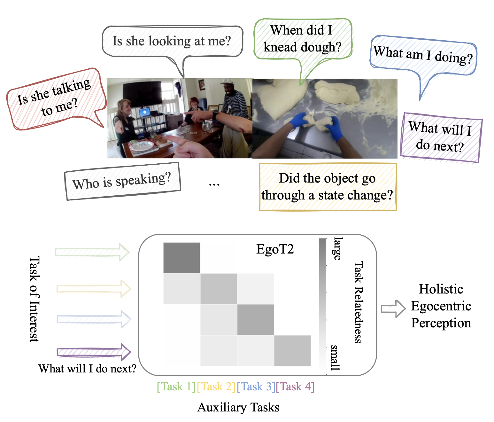

# Egocentric Video Task Translation (EgoT2)
[**Egocentric Video Task Translation**](https://openaccess.thecvf.com/content/CVPR2023/html/Xue_Egocentric_Video_Task_Translation_CVPR_2023_paper.html)                                     
Zihui Xue, Yale Song, Kristen Grauman, Lorenzo Torresani         
CVPR 2023 (**Highlight**, acceptance rate≈2.5%)          
1st Place in Talking-To-Me, 3rd Place in PNR Keyframe Localization @  [Ego4D 2022 ECCV challenges](https://ego4d-data.org/workshops/eccv22/).   
[project page](https://vision.cs.utexas.edu/projects/egot2/) | [arxiv](https://arxiv.org/abs/2212.06301) | [bibtex](#citation)

## Overview
We propose task translation as a new learning paradigm to leverage synergies across different egocentric video tasks.
<p align="center">
  
</p>

We select 7 diverse video tasks from the world's largest egocentric dataset [Ego4D](https://ego4d-data.org), capturing both human-human interactions (HHI) and human-object interactions (HOI). 

| Category | Task                                           | Description                                                                                                                                                     |
|----------|------------------------------------------------|-----------------------------------------------------------------------------------------------------------------------------------------------------------------|
| HHI      | Looking At Me (LAM)                            | Given an egocentric video in which the faces of social partners have been localized and identified, classify whether each face is looking at the camera wearer. | 
 | HHI      | Talking To Me (TTM)                            | Given a video and audio with the same tracked faces, classify whether each face is talking to the camera wearer.                                                |
 | HHI      | Active Speaker Detection (ASD)                 | Given a cropped face video clip and corresponding audio segments, identify whether this person is speaking.                                                     |
 | HOI      | Point-of-no-return Keyframe Localization (PNR) | Given a short video of a state change, estimate the keyframe that contains the time at which a state change begins.                                             | 
 | HOI      | Object State Change Classification (OSCC)      | Given a video clip, classify whether an object state change has taken place or not.                                                                             |
| HOI      | Action Recognition (AR)                        | Given a video clip, classify the action (verb and noun) of the camera wearer.                                                                                   |
| HOI      | Long-term Action Anticipation (LTA)            | Given a video clip, predict the camera wearer’s future sequence of actions; the action vocabulary is identical to that used in AR.                              |

This repo:
+ integrates the training code for these 7 tasks (see stage-I training code for [HHI](#stage-i-train-hhi-task-specific-models) and [HOI](#stage-i-train-hoi-task-specific-models))
+ provides code for [training](#stage-ii-egot2-s-task-specific-translation-to-improve-the-task-of-interest) and [inference](#inference--challenge-submission) with our task translation framework (EgoT2)
+ provides a model zoo with EgoT2 model checkpoints developed for each task.

## Installation
See [installation instructions](./docs/INSTALL.md).

## Data preparation
See data preparation instructions for [human-human interaction tasks](./docs/PREPARE_HHI.md) and [human-object interaction tasks](./docs/PREPARE_HOI.md).

## Training
### HHI (human-human interactions)
Go to the `HHI` directory
#### Stage I: train HHI task-specific models 
[Important] Stage I is optional --- The official [Ego4D repo](https://github.com/facebookresearch/Ego4d) releases a collection of model checkpoints developed for each individual task,
we can adopt them as the task-specific models in EgoT2.
Download these model checkpoints [here](https://drive.google.com/drive/folders/1ZlkDilo5AvQTjowBqsS6lWXEsxhmNCgW?usp=share_link) and rename the folder under the main directory as `pretrained_models`.

Additionally, we can train our own version of the task-specific model as follows. 

1-GPU training for now
<details><summary>LAM</summary>

```shell
python scripts/run_lam.py --model BaselineLSTM --output_dir ts_model
```
Logs will be saved in `./logs/lam/ts_model`.
</details>


<details><summary>TTM</summary>

```shell
python scripts/run_ttm.py --model BaselineLSTM --output_dir ts_model
```
Logs will be saved in `./logs/ttm/ts_model`.
</details>

<details><summary>ASD</summary>

```shell
python scripts/run_asd.py --model talkNetModel --output_dir ts_model
```
Logs will be saved in `./logs/asd/ts_model`.
</details>

EgoT2 is very flexible and can work with any task-specific model. Feel free to replace the task-specific model with your design (e.g., modify `models/ttm/model.py` and run the training script accordingly).


#### Stage II (EgoT2-s): task-specific translation to improve the task of interest

(1) Task of interest is TTM
```shell
# Improve TTM with LAM+TTM
python scripts/run_ttm.py --model TaskFusionMFTransformer2Task --num_layers 1 --hidden_dim 128 --dropout 0.5 --output_dir 2tasktranslation

# Improve TTM with LAM+TTM+ASD
python scripts/run_ttm.py --two_loader --model TaskFusionMFTransformer3Task --num_layers 1 --hidden_dim 128 --dropout 0.5 --output_dir 3tasktranslation
```

<details><summary>(2) Task of interest is ASD</summary>

```shell
# Improve ASD with LAM+TTM+ASD
python scripts/run_asd.py --model TaskFusionMFTransformer3Task --output_dir 3tasktranslation
```

</details>

#### Stage II (EgoT2-g): task-general translation to jointly optimize all HHI tasks
```shell
python scripts/run_multitask.py --task_translation --output_dir output_dir
```
Logs will be saved in `./logs/multitask/output_dir`

&nbsp;
### HOI (human-object interactions)
Go to the `HOI` directory
#### Stage I: train HOI task-specific models
[Important] Stage I is optional --- We provide the pretrained HOI task-specific models based on official Ego4D implementation [here](https://drive.google.com/drive/folders/1ZlkDilo5AvQTjowBqsS6lWXEsxhmNCgW?usp=share_link). Download them and rename the folder under the main directory as `pretrained_models`.

Additionally, we can train our own version of the task-specific model as follows. 

<details><summary>PNR</summary>

```shell
python scripts/pnr/train.py --cfg configs/pnr/baseline/keyframe_bce.yaml
```
</details>

<details><summary>OSCC</summary>

```shell
python scripts/pnr/train.py --cfg configs/pnr/baseline/statechangecls.yaml
```
</details>

<details><summary>AR</summary>

```shell
# Local run
bash scripts/ego4d_recognition_local.sh

# Slurm
bash scripts/ego4d_recognition.sh job_name configs/recognition/baseline/MULTISLOWFAST_8x8_R101.yaml
```
</details>

<details><summary>LTA</summary>

```shell
# Local run
python scripts/lta/run_lta.py --cfg configs/lta/baseline/slowfast_pretrain_ego4d.yaml

# Slurm
bash scripts/ego4d_forecasting.sh job_name configs/lta/baseline/slowfast_pretrain_ego4d.yaml
```
</details>

#### Stage II (EgoT2-s): task-specific translation to improve the task of interest
(1) Task of interest is PNR
```shell
python scripts/pnr/train.py --cfg configs/pnr/ts_pnr.yaml
```
Logs will be saved in `./logs/pnr/3tasktranslation`

(2) Task of interest is OSCC
```shell
python scripts/pnr/train.py --cfg configs/pnr/ts_pnr.yaml
```

(3) Task of interest is AR
```shell
python scripts/lta/run_lta.py --cfg configs/recognition/ts_ar.yaml
```

(4) Task of interest is LTA
```shell
# Improve LTA with AR+LTA
python scripts/lta/run_lta.py --cfg configs/lta/ts_lta_2task.yaml

# Improve LTA with PNR+OSCC+AR+LTA
python scripts/lta/run_lta.py --cfg configs/lta/ts_lta_4task.yaml
```

#### Stage II (EgoT2-g): task-general translation to jointly optimize all HOI tasks
```shell
python scripts/multitask/run.py --task unify6task --output_dir egot2g_6tasktranslation
```

## Inference & Challenge submission
We provide the EgoT2 checkpoints [here](https://drive.google.com/drive/folders/1nkxAmFFXZkZV3r8BaB5lH8jkk18Y_a1v?usp=share_link). Download them to skip training and put `egot2_checkpoints` under the main directory.
### HHI (human-human interactions)
Go to the `HHI` directory

+ EgoT2-s for TTM achieves 1st place in [Ego4D TTM challenge](https://eval.ai/web/challenges/challenge-page/1625/) @ ECCV 2022.


|                 | Task-specific model | EgoT2-s (2 task translation) | EgoT2-s (3 task translation) |
|-----------------|---------------------|------------------------------|------------------------------|
| TTM Val mAP (%) | 58.91               | 65.89                        | **66.54**                    |        |

Inference (val data) & Generate the submission file (test data)

```shell
# Inference with EgoT2-s (2 task translation)
python scripts/run_ttm.py --eval --model TaskFusionMFTransformer2Task  --num_layers 1 --hidden_dim 128 --dropout 0.5 --ckpt ./egot2_checkpoints/ttm/egot2s_2task_128_l1_dp0.5_epoch=23-step=1824.ckpt 
# Generate submission file
python scripts/run_ttm.py --submit --model TaskFusionMFTransformer2Task  --num_layers 1 --hidden_dim 128 --dropout 0.5 --ckpt ./egot2_checkpoints/ttm/egot2s_2task_128_l1_dp0.5_epoch=23-step=1824.ckpt 

# Inference with EgoT2-s (3 task translation)
python scripts/run_ttm.py --eval --two_loader --model TaskFusionMFTransformer3Task --num_layers 1 --hidden_dim 128 --dropout 0.5 --ckpt ./egot2_checkpoints/ttm/egot2s_3task_128_l1_dp0.5_epoch=6-step=532.ckpt
# Generate submission file
python scripts/run_ttm.py --submit --two_loader --model TaskFusionMFTransformer3Task --num_layers 1 --hidden_dim 128 --dropout 0.5 --ckpt ./egot2_checkpoints/ttm/egot2s_3task_128_l1_dp0.5_epoch=6-step=532.ckpt
```
The `submit_ttm.json` file will be generated under the current directory.

&nbsp;
### HOI (human-object interactions)
Go to the `HOI` directory

+ EgoT2-s brings consistent improvement over the task-specific model across all HOI tasks.
+ EgoT2-s for PNR achieves 3rd place in [Ego4D PNR challenge](https://eval.ai/web/challenges/challenge-page/1622/) @ ECCV 2022.

|                                | Task-specific model | EgoT2-s (3 task translation) |
|--------------------------------|---------------------|------------------------------|
| PNR Val localization error (s) | 0.615               | **0.610**                    |
| OSCC Val Acc. (%)              | 68.22               | **72.69**                    |
 | AR Val Verb Acc. (%)           | 22.18               | **23.04**                    |
| AR Val Noun Acc. (%)           | 21.55               | **23.28**                    |
 | LTA Val Verb ED@20             | 0.746               | **0.731**                    |
 | LTA Val Noun ED@20             | 0.789               | **0.769**                    |

```shell
# Inference on PNR (val) with EgoT2-s
python submission/eval_pnr.py --eval --cfg configs/eval/ts_pnr.yaml
# Generate submission file
python submission/eval_pnr.py --submit --cfg configs/eval/ts_pnr.yaml

# Inference on OSCC (val) with EgoT2-s
python submission/eval_oscc.py --eval --cfg configs/eval/ts_oscc.yaml
# Generate submission file
python submission/eval_oscc.py --submit --cfg configs/eval/ts_oscc.yaml

# Inference on AR (val) with EgoT2-s
python submission/eval_ar.py --cfg configs/eval/ts_ar.yaml
# AR task is not included in the Ego4D challenges

# Inference on LTA (val) with EgoT2-s
python submission/eval_lta.py --eval --cfg configs/eval/ts_lta.yaml
# Generate submission file
python submission/eval_lta.py --submit --cfg configs/eval/ts_lta.yaml
```
The `submit_{pnr/oscc/lta}.json` file will be generated under the current directory.

## License
EgoT2 is licensed under the [CC-BY-NC license](LICENSE).

## Citation
If you find our work inspiring or use our codebase in your research, please consider giving a star ⭐ and a citation.
```
@inproceedings{xue2023egot2,
      title={Egocentric Video Task Translation},
      author={Xue, Zihui and Song, Yale and Grauman, Kristen and Torresani, Lorenzo},
      booktitle={Proceedings of the IEEE/CVF Conference on Computer Vision and Pattern Recognition},
      pages={2310--2320},
      year={2023}
}
```
